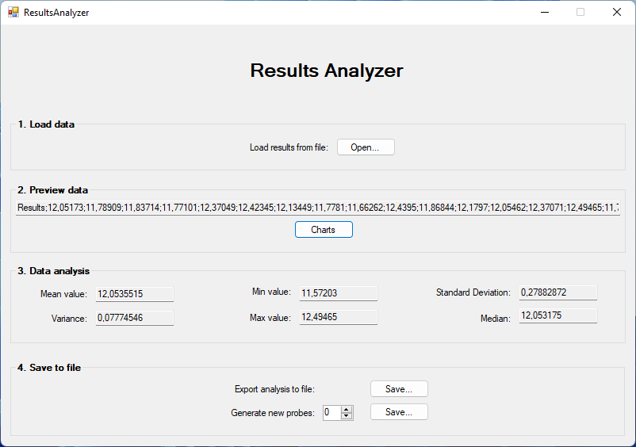
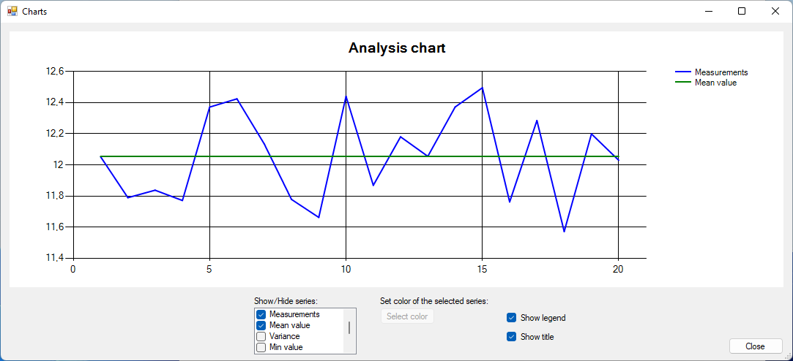

# Results Analyzer
Results Analyzer is a user-friendly program, that processes the results, analyzes and visualizes them.

# Features

* User-friendly and light
* Opens a text file with saved measurement results
* Parses the contained text to extract the numeric values of the measurements
* Calculates some measurement parameters (mean value, variance, minimum value, and
maximal)
* Saves calculated parameters to a text file
* Giving the visualization of the measurement values on the fully customizable chart
* Availability to generate new probes

# Technologies and tools
Project created with:
* .NET Framework v4.7.2
* based on Windows Forms

Used IDE:
- Visual Studio 2022

# Screenshots

